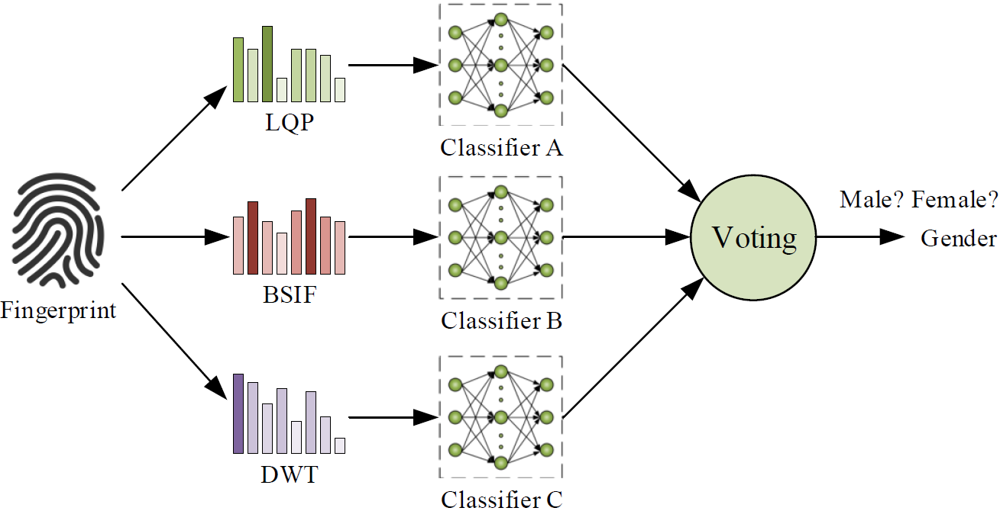
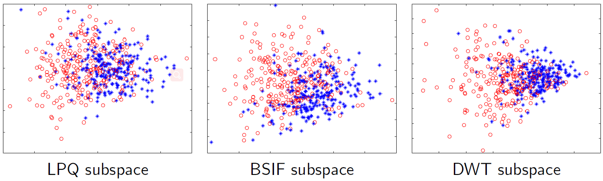
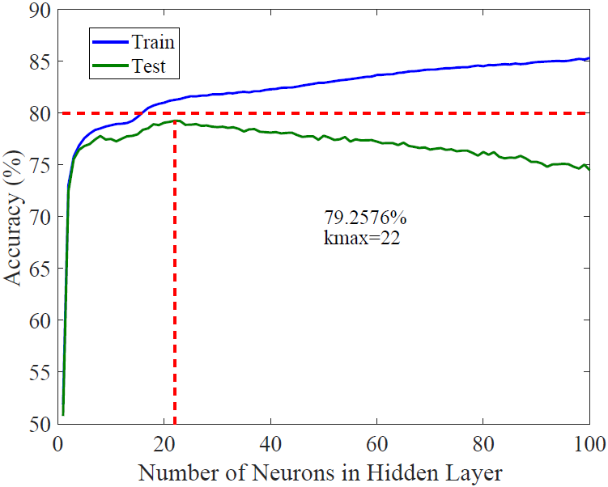
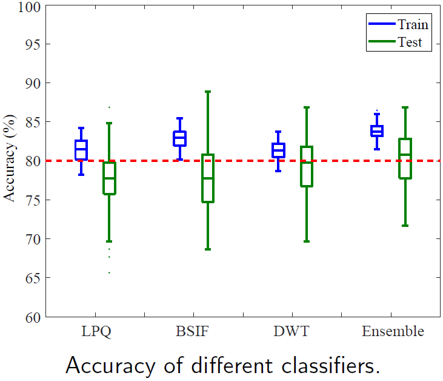

# Tenko
## Gender Inference from Fingerprint Images

Note: 'Tenko' is just a project code.
The project needs to add libsvm library.

### Overview:

The architecture of our proposed gender inference method is show in Figure 1.

The input fingerprint images are firstly used to extract the spatial and spectrum features, i.e., LQP, BSIF, and DWT features. For each type of feature, a three-layer neural network classifier is trained. The parameters in each classifier are different and optimal based on the feature training. For each classifier, there is an individual output for the gender inference. Then the final gender attribute would be determined by these three individual outputs with majority voting mechanism. Because the gender inference is actually a binary classification task, any gender label gets not less than 2 votes will dominate the final result.

### Feature Visualization

To verify the effectiveness of these three fingerprint features, we utilize the Principle Component Analysis (PCA) to reduce the dimensionality of feature space. The 2D feature subspaces in Figure 2 show the different distributions of female and male fingerprint features, illustrating the feature effectiveness. 

### Parameter Selection

Although the weak classifiers are three-layer fully-connected neural networks, they have different parameters in the implementation. We test the relationship between model parameters (i.e. neuron number of hidden layer) and testing accuracy. The parameters are determined under the highest testing accuracy. The parameters of 3 classifiers are 40, 30, and 22 respectively.

### Classification Performance

Because the training and testing data are selected randomly, the results of each repeated experiment are different. To verify the robustness of our proposed method, we conduct 100 repeated experiments on each weak classifier and the ensemble voting classifier. The statistical results are illustrated in Figure 4.

We can find that the ensemble voting model can achieve 80.3\% testing accuracy on average, which is higher than that of any other single weak classifier. The cross-sensor testing accuracy can also reach 67.48\%. The results show the effectiveness of the ensemble voting model on gender inference task.

2019-12-01
